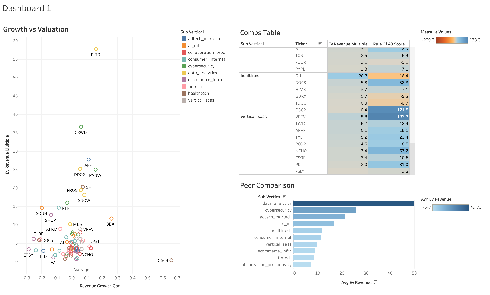

# Growth & Tech Comps Benchmarking Tool

A SQL + Python pipeline and interactive Tableau dashboard that benchmarks ~75 public growth/tech companies against their peers on valuation (EV/Revenue) and growth-efficiency (Rule of 40) — the kind of comps analysis used in venture capital, growth equity, and TMT investment banking before a financing round, IPO, or public comps memo.

**[View the live dashboard on Tableau Public →](https://public.tableau.com/app/profile/shreya.bhat3881/viz/GrowthTechCompsDashboard/Dashboard1)**



## What it does

For a set of ~75 public companies across 10 sub-verticals (cybersecurity, fintech, AI/ML, vertical SaaS, and others), this project:

1. Pulls quarterly financial statements for each company
2. Computes two key comps metrics from raw statement data (rather than relying on a pre-built API field):
   - **EV/Revenue** — enterprise value divided by trailing-twelve-month revenue, the standard valuation multiple for growth companies that aren't yet profitable
   - **Rule of 40** — quarterly revenue growth + free cash flow margin, a widely used SaaS/growth-company health check (a score of 40+ is considered healthy)
3. Loads everything into a SQLite database and uses SQL window functions (`RANK()`, `PERCENT_RANK()`) to rank each company against only its direct sub-vertical peers
4. Visualizes the results in an interactive Tableau Public dashboard with three linked views

## Tech stack

- **Python** (`yfinance`, `pandas`) — data collection and metric calculation
- **SQLite + SQL** — storage, views, and peer-ranking window function queries
- **Tableau Public** — interactive dashboard and publishing

## Dashboard views

- **Growth vs. Valuation** — scatter plot of quarterly revenue growth vs. EV/Revenue multiple, with an average-multiple reference line, colored by sub-vertical
- **Comps Table** — every company's EV/Revenue and Rule of 40 score, heat-mapped and sorted within each sub-vertical group
- **Peer Comparison** — average EV/Revenue multiple by sub-vertical, showing which industries currently command the richest valuations

## How to reproduce it

```bash
git clone <your-repo-url>
cd comps-dashboard
python3 -m venv venv
source venv/bin/activate
pip install -r requirements.txt

python scripts/pull_data.py            # pull data from Yahoo Finance via yfinance
python scripts/build_schema.py         # create the SQLite schema
python scripts/load_data.py            # load data + build SQL views
python scripts/export_for_tableau.py   # export views to CSV for Tableau
```

Then open `tableau/comps_dashboard.twbx` in Tableau Public (or reconnect the CSVs in `tableau/exports/` if starting fresh).

## Known data limitations

- **Revenue growth is quarter-over-quarter (QoQ), not year-over-year (YoY).** Yahoo Finance's free quarterly statements typically only return the ~4-5 most recent quarters — not enough history to reliably compute a true 4-quarter-back YoY comparison. QoQ growth was used instead as an honest substitute.
- **Market cap (and therefore EV) reflects a current snapshot, not a historical point-in-time value.** The free data source used doesn't provide historical market cap, so the same current market cap is applied across all historical quarters for a given company. This means EV/Revenue in older quarters is less precise than in the most recent quarter.
- A small number of tickers (~6-8 out of ~81 attempted) failed to return usable data, likely due to delistings, recent ticker changes, or gaps in free-tier data coverage, and were excluded.
  
## Possible future improvements

- Add a company-search parameter to see one company's exact peer rank on demand
- Pull historical market cap data (would require a paid data source) for true point-in-time EV
- Extend to true YoY growth using annual (rather than quarterly) statements
